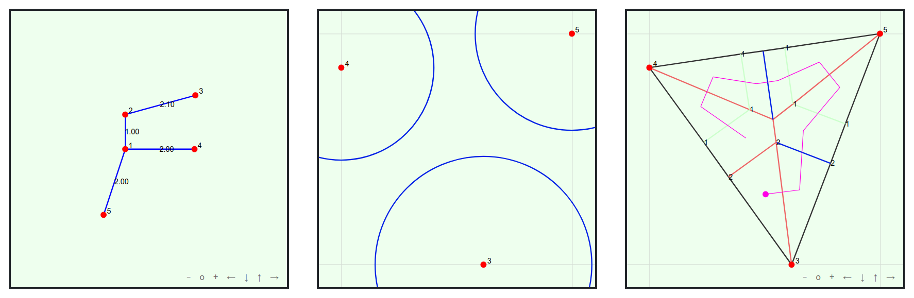

# TreeFaker

View online at: <a href="https://6849-2020.github.io/treefaker/index.html">6849-2020.github.io/treefaker</a><br/>



**Authors**: Parker Rule (@pjrule), Jamie Tucker-Foltz (@jtuckerfoltz)

**Contributors**: Andy Tockman (@tckmn)

This MIT 6.849 final project is a lightweight web-based implementation of Robert J. Lang's [TreeMaker](https://langorigami.com/article/treemaker/) software for origami design.
## Running locally

This project uses Node.js and Vue.js; to run locally, ensure that you have a recent version of Node.js (≥v10.16.3) and NPM (≥6.9.0) installed.

### Project setup
```
yarn install
```

### Compiles and hot-reloads for development
```
yarn serve
```

### Compiles and minifies for production
```
yarn build
```

### Run unit tests
```
yarn test:unit
```

### Lints and fixes files
```
yarn lint
```

### Customize configuration
See [Configuration Reference](https://cli.vuejs.org/config/).

## Attributions
We stand on the shoulders of giants. Particularly:
* Some parts of the disk packing and universal molecule modules are based heavily on Lang's TreeMaker 5 implementation. Citations are included within individual files.
* We use some CSS styles from [Origami Simulator](https://origamisimulator.org/).
* We use a GitHub deploy script [from Roland Doda](https://dev.to/rolanddoda/deploy-to-github-pages-like-a-pro-with-github-actions-4hdg).
* The GUI is built with [JSXGraph](https://jsxgraph.uni-bayreuth.de/wp/index.html).
